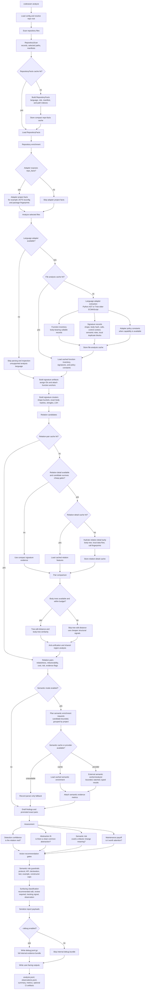

# METHODOLOGY

## Pipeline

```mermaid
flowchart TD
    A["codeseam analyze"] --> B["Load config and resolve repo root"]
    B --> C["Scan repository files"]
    C --> D["RepositoryScan<br/>records, selected paths, manifests"]
    D --> E{"RepositoryFacts cache hit?"}
    E -- yes --> F["Load RepositoryFacts"]
    E -- no --> G["Build RepositoryFacts<br/>language, role, manifest, and path indexes"]
    G --> H["Store compact repo-facts cache"]
    H --> F

    F --> I["Repository enrichment"]
    I --> J{"Adapter exposes repo_facts?"}
    J -- yes --> K["Adapter project facts<br/>for example JS/TS tsconfig and package fingerprints"]
    J -- no --> L["Skip adapter project facts"]
    K --> M["Analyze selected files"]
    L --> M

    M --> MA{"Language adapter available?"}
    MA -- no --> MB["Skip parsing and inspection<br/>unsupported analysis language"]
    MA -- yes --> N{"File analysis cache hit?"}
    N -- yes --> O["Load cached function inventory,<br/>signatures, and policy constants"]
    N -- no --> P["Language adapter extraction<br/>Python AST or Tree-sitter ECMAScript"]
    P --> Q["Function inventory<br/>body-bearing callable records"]
    P --> R["Signature records<br/>shape, body hash, calls, control context,<br/>semantic roles, local duplicate blocks"]
    P --> PC["Adapter policy constants<br/>when capability is available"]
    Q --> S["Store file-analysis cache"]
    R --> S
    PC --> S
    S --> O
    MB --> T

    O --> T["Build signature artifacts<br/>assign IDs and attach function anchors"]
    T --> U["Build signature clusters<br/>shape buckets, exact body hashes, shingles, LSH"]
    U --> V["Relation candidates"]
    V --> VP{"Relation-pair cache hit?"}
    VP -- yes --> AE["Relation pairs<br/>relatedness, refactorability, cost, risk, evidence flags"]
    VP -- no --> W{"Relation detail available<br/>and candidate survives cheap gates?"}
    W -- no --> X["Use compact signature evidence"]
    W -- yes --> Y{"Relation-detail cache hit?"}
    Y -- yes --> YA["Load cached relation features"]
    Y -- no --> YB["Hydrate relation detail lazily<br/>body tree, local data flow, call fingerprints"]
    YB --> YC["Store relation-detail cache"]

    X --> Z["Pair comparison"]
    YA --> Z
    YC --> Z
    Z --> AA{"Body trees available and within budget?"}
    AA -- yes --> AB["Tree edit distance and body-tree similarity"]
    AA -- no --> AC["Skip tree edit distance<br/>use cheaper structural signals"]
    AB --> AD["Anti-unification and shared-region analysis"]
    AC --> AD

    AD --> AE["Relation pairs<br/>relatedness, refactorability, cost, risk, evidence flags"]
    AE --> SA{"Semantic mode enabled?"}
    SA -- yes --> SB["Plan semantic enrichment requests<br/>candidate-bounded, grouped by project"]
    SB --> SC{"Semantic cache or provider available?"}
    SC -- cache --> SD["Load cached semantic enrichment"]
    SC -- provider --> SE["External semantic worker/analyzer<br/>bounded, batched, typed results"]
    SC -- unavailable --> SF["Record parser-only fallback"]
    SA -- no --> AF["Draft findings and promoted exact pairs"]
    SD --> SG["Attach semantic evidence metrics"]
    SE --> SG
    SF --> AF
    SG --> AF
    AF --> AG["Assessment"]
    AG --> AH["Detection confidence<br/>is the relation real?"]
    AG --> AI["Abstraction fit<br/>is there a clean common abstraction?"]
    AG --> AJ["Semantic risk<br/>could a refactor change meaning?"]
    AG --> AK["Maintenance payoff<br/>is it worth attention?"]
    AH --> AL["Action recommendation gates"]
    AI --> AL
    AJ --> AL
    AK --> AL

    AL --> AM["Semantic role guardrails<br/>protocol, API, declaration, test, example, constructor caps"]
    AM --> AN["Surfacing classification<br/>recommended edit, review required, tracking signal, observation"]
    AN --> AO["Serialize report payloads"]
    AO --> AP{"--debug enabled?"}
    AP -- yes --> AQ["Write debug.jsonl.gz<br/>full internal evidence bundle"]
    AP -- no --> AR["Skip internal debug bundle"]
    AQ --> AS["Write user-facing outputs"]
    AR --> AS
    AS --> AT["analysis.jsonl, observations.jsonl,<br/>summary, metrics, optional CI artifacts"]
```

